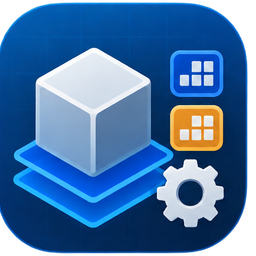

# Collision Presets



**Collision Presets** is a Godot 4 editor plugin for saving and reusing collision layer and mask configurations through reusable Resources.

Instead of manually configuring the same collision layers and masks on many nodes, create one or more `CollisionPresetsDatabase` resources and assign a preset directly from the Inspector.

## Features

- Create as many `CollisionPresetsDatabase` resources as you need.
- Organize presets by system, for example characters, interactables, environment, or vehicles.
- Apply presets to `CollisionObject3D`, `CollisionObject2D`, and `CSGShape3D` nodes.
- Select the database Resource and preset directly from the Inspector.
- Automatically apply the selected collision layer and mask.
- Keep references valid when a preset is renamed through an internal stable ID.
- Add an optional description to each preset.
- Reapply presets at runtime through the plugin autoload.
- On `CSGShape3D`, preset controls appear under **Use Collision** and are shown only when collision is enabled.

## Resource Structure

### `CollisionPreset`

Each preset contains:

- `name` — name shown in the preset dropdown.
- `id` — hidden stable identifier generated by the plugin.
- `description` — optional note about the preset or where it is used.
- `layer` — collision layer flags.
- `mask` — collision mask flags.

### `CollisionPresetsDatabase`

A database contains:

- `presets` — `Array[CollisionPreset]`

You can create multiple database Resources in the same project.

Example:

```text
Presets/
├── CharactersPresets.tres
├── InteractablesPresets.tres
├── EnvironmentPresets.tres
└── VehiclesPresets.tres
```

## Installation

1. Copy the `collision_presets` folder into:

   ```text
   res://addons/collision_presets/
   ```

2. Open **Project > Project Settings > Plugins**.
3. Enable **Collision Presets**.

The plugin automatically registers its runtime autoload while enabled.

## Usage

### 1. Create a database

Create a new Resource of type `CollisionPresetsDatabase` and save it anywhere in your project.

For example:

```text
res://Presets/CharactersPresets.tres
```

### 2. Add presets

Add `CollisionPreset` resources to the database `presets` array.

Example `Player` preset:

```text
Name:        Player
Description: Used by the player CharacterBody3D
Layer:       2
Mask:        2
```

The plugin automatically generates an internal ID for the preset. The ID is hidden in the Inspector and is used to keep references valid if the preset is renamed later.

### 3. Assign the preset to a node

Select a supported collision node in the Inspector.

Choose:

```text
Preset Database: CharactersPresets.tres
Preset:          Player
```

The node's collision layer and mask are immediately updated from the selected preset.

### 4. Rename presets safely

Nodes reference presets using the internal ID rather than only the preset name.

This means you can rename:

```text
Player
```

to:

```text
Player Character
```

without breaking nodes that already use that preset.

## CSGShape3D

`CSGShape3D` and its derived nodes are supported.

The preset controls are displayed directly below **Use Collision** and only while **Use Collision** is enabled.

Examples include:

- `CSGBox3D`
- `CSGSphere3D`
- `CSGCylinder3D`
- other `CSGShape3D` derived nodes

## Runtime Behavior

When the plugin is enabled, it registers the `CollisionPresetRuntime` autoload.

At runtime it applies saved presets to supported nodes already in the scene tree and to supported nodes added later.

## Notes

- A node stores both the selected database Resource and preset ID.
- Preset names do not need to be globally unique because each node also references its database.
- Avoid manually duplicating preset IDs. The editor automatically repairs missing or duplicated IDs when a database is used.
- Clearing a preset reference does not reset the node's current collision layer or mask values.
